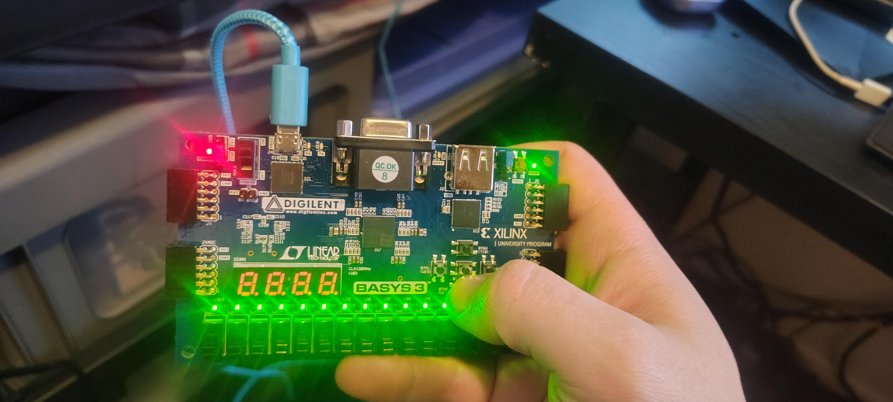

# Rust-on-Arduino
## Overview

This Project demonstrates using a Basys3 FPGA as a Microcontroller; using Vivado to create a Block Design for a
Microcontroller, we were able to flash hardware for the RISC-based Xilinx MicroBlaze, which had its program
written in C.

Some unique additions that I made, included that I changed how the serial output is utilized;
now, instead of consistently outputting serial data, it waits for a change in the button states before outputting another
update on the buttons (A simple xor with the button's previous state, if the result is non-zero, the display will update). Next, I added a clear screen output to the terminal
using a common escape sequence. This now clears the serial monitor output on restart. Lastly, I changed the
serial output to not only include a carriage return (\r), but also a line feed (\n) to address serial monitors that do not acknowledge a carriage return 
(including the current version of Vitis' Serial Monitor) 

## Demonstration

Here is a [Software Demo Video](https://youtu.be/APoEbTP7JAo) of the project in operation

Additionally, I have provided some pictures demonstrating the Functionality of the program running
on the FPGA's MicroBlaze Microcontroller.

First, the board without any buttons pressed:

Next, demonstrating the LED's light up on button-press:

Third, the Board next to a Serial Monitor in Vitis (shows some previous inputs):

Finally, demonstrating the Serial Monitor update the current button states when a button is pressed:
(note the new line on the serial monitor showing the current active state)

## Development Environment

This project was developed using Vivado 2023.2 to design our hardware, and export our XSA file. Our
XSA file was then Imported into the Vitis 2024.2 Unified IDE, where the program running on the microcontroller was written and compiled in C.

## Useful Websites

- [AMD - Vivado: Creating a Block Design](https://docs.amd.com/r/en-US/ug994-vivado-ip-subsystems/Creating-a-Block-Design?tocId=nV0tKs8Tvl5waptIzDxHqw)
- [AMD - Creating a Vitis Unified Platform Project](https://docs.amd.com/r/2024.1-English/ug1165-zynq-embedded-design-tutorial/Creating-a-Vitis-Unified-Platform-Project)
- [AMD - Vitis: Building Projects](https://docs.amd.com/r/en-US/ug1400-vitis-embedded/Building-Projects)

## Future Work

- Flash to Non-Volatile ROM of Basys3 Board
- More I/O Functionality